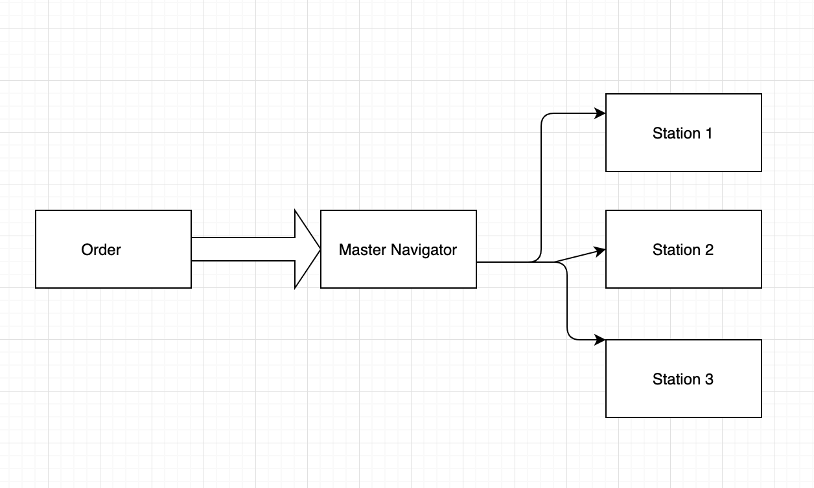

# Restaurant POS App

A simple restaurant POS app implemented with React and a Python backend

## Basic Implementation

Summarizing the steps for Restaurant POS app implementation

```bash
 Order Flow:

1 Orders pass through Cashier and Master Navigator concurrently
2 Master Navigator Screen controls the following workflow of the whole process
   - Ability to allot orders to different stations based on their expertise ( Eg: Fish station, Steak Station)
   - Display of time stamp of orders commencing and the current time
   - Time stamp warnings and alerts for delayed order for 5 minutes, 10 minutes and 20 minutes with green, yellow and red display
   - Print POS invoice for order once its done and allocate tables for the order
   - Ability to delay order or alter order based on workstation load
```


```bash
 Ingredients Calculation:

1. Consists of three different indicators. Raw indicator, Segmented indicator and Finished indicator
   - Raw indicator calculates the overall ingredients needed for the sample order
   - Segmented indicator indicates the quantity that needs to be used when refined from raw indicator
   - Finished indicator gives the ingredients and their quantity that are to be required for the current order
  
```
## BackendAPI

```
Python BackendAPI is responsible for creating and updating order list, order information, storing order data for future use.
```

## Database
Firebase Database is the recommended database for this real time application

## Application flow



